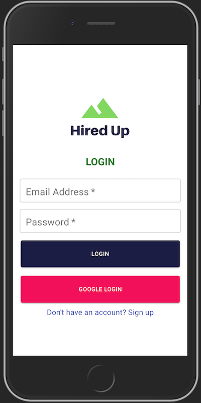
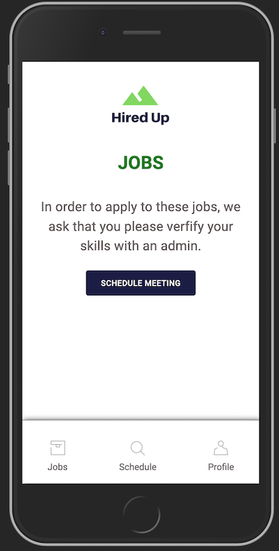
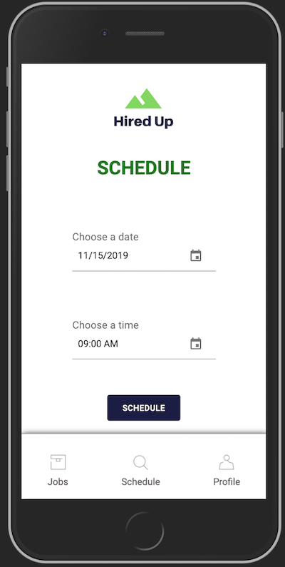
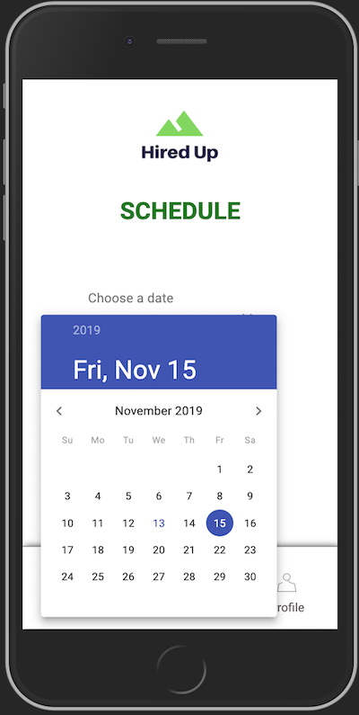
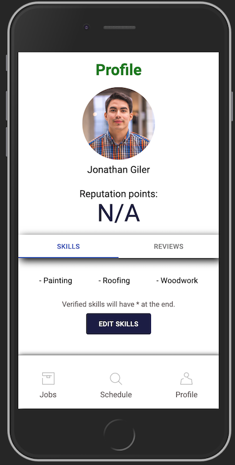
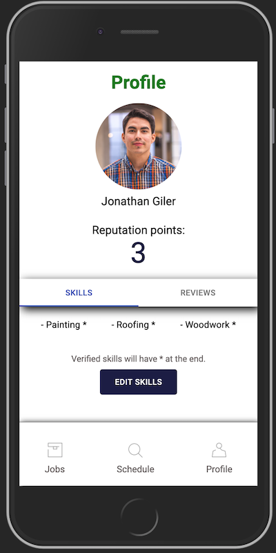
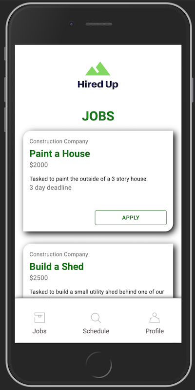

# Hired Up App
Hearing that Charlotte, NC was last in economic mobility amongst the largest cities in the United States, our team knew we had to act. We came up with the idea for Hired Up. This application confronts the problem head on, give people jobs! Many individuals in lower income households can’t afford to go through long periods of unpaid training. The lack of income would leave them without food and possibly shelter. This is why a lot of them have to abandon their training in pursuit of a minimum wage job that they can barely get by on. With Hired Up these individuals would be able to find on-demand work without the hassle of long interviews or the commitment of a full time but lesser paying position than what they may be able to obtain being able to complete training.


## Reaching the Community
We are working to connect with local non-profits to find the individuals who need this app, as well as ensure they have the necessary resources to access it. Our first thought was NC Works. This organization has facilities where individuals can use computers to apply for jobs. It is usually where citizens in unemployment are directed. We also found the Goodwill Opportunity Center which has a job resource branch to help people find employment. By working with these kinds of programs we can reach our audience and help these centers quickly find solutions for those in need.

## App features
With the app users can sign up with either a new username and password or through their google accounts



When the user first logs in they will see a screen telling them they need to schedule a meeting with a Hire Up admin. This meeting would be to verify our users and their skills.



After clicking the button you are taken to our schedule page where the user is able to pick a date to meet an admin.




There is also a user profile page with photo, name, reputation points, skills, and reviews. Before becoming verified the user does not have any reputation points.



Once the user has met with an admin they will be awarded 3 reputation points and their skills will become verified.



The new verified skills also allow the user to see corresponding job postings that they can apply for.



## Getting Started with the Code
To use this app first run
```bash
npm install
```
This will install all of the dependencies for the app. 
Then to run the app you will need to use
```bash
npm start
```
This starts both the server and the client react app thanks to our scripts and the dependency concurrently.

## Built With

* [React](https://github.com/facebook/react) - The framework used
* [NodeJS](https://github.com/nodejs/node) - The development for server
* [Express & Express Router](https://github.com/expressjs/express) - Used to create endpoints
* [Concurrently](https://github.com/kimmobrunfeldt/concurrently) - Used to run servers at the same time
* [MongoDbAtlas](https://www.mongodb.com/cloud/atlas) - Database
* [Mongoose](https://mongoosejs.com/) - Helped manipulate database
* [Material UI](https://material-ui.com/) - Styling on app
* [Passport](https://www.npmjs.com/package/passport) - Authentication for app

## Proposal
* [Proposal](https://docs.google.com/document/d/1-H_KQOKNLhcW2E5N2wVC8EJOMko52lT8BuZAoHtmsgM/edit)

## Live Demo Video
* [Video](https://www.youtube.com/watch?v=oDis6TNTPyk&t=1s)


## Author
* [Lucy Yang](https://github.com/l-yang-05)


## License
[MIT](https://github.com/SkylerCStevens/Fix-Fifty-App/blob/master/LICENSE)
